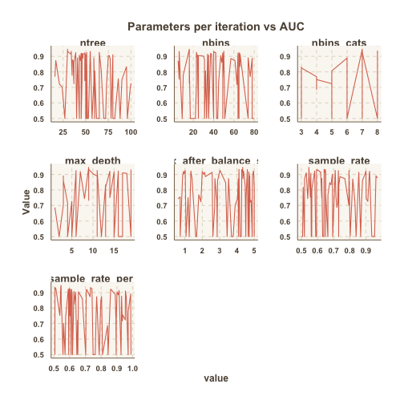

En este apartado se presenta la selección de models aplicados y su optimización.  

----

### Concepto Básico

El objetivo principal de este proyecto es la recomendación del siguiente producto a comprar por un determinado Customer_ID. Como hemos visto en apartados anteriores, disponemos de variables tanto socio-demográficas como variables relacionadas con el historial de compra del usuario. En el caso particular, además, se ha añadido la variable resultant de los *cluster* sobre el Customer_ID creados en apartados anteriores. 

La matriz final es, por tanto, una matrix de 117 variables con una fila por cada customer ID. Estas 117 variables son las que usaremos como predictores para nuestro modelo. Entre dichos predictores disponemos de: 

* Variables de "producto anteriormente comprado" (94, uno por producto existente) 
* Variables socio-demográficas iniciales (4 variables) 
    + cluster_id (1 variable)
* Variables relacionadas con el historial de compra
    + Relacionadas con la periodicidad (4 variables) 
    + Relacionadas con el *mes de mayor compra* (12, una por cada mes del año) 
* ID del último producto comprado (1 variable) 
* ID del posible producto a recomendar (1 variable). 

La idea principal es crear un modelo (o un ensamble de varios) que tenga como entrada los predictores mencionados anteriormente y como salida la variable target u objetivo. Dicha variable es, en nuestro caso, una variable dicotómica de 0 o 1, donde el 0 representa la no compra y el 1 la compra. Entonces, la idea es crear una matriz para cada usuario o customer_id con la variable extra del producto a recomendar e intentar predecir si ese  producto será comprado como el *siguiente* o si no será comprado. El modelo, entonces, generará una probabilidad de compra para cada producto ofrecido al customer (en nuestro caso, para los  94 productos disponibles). Finalmente se ordenará usando dicha probabilidad y se recomendará al usuario el producto con mayor probabilidad de compra (és decir, mayor probabilidad de ser el siguiente a recomendar). 

Al tratarse de un problema de clasificación se usarán básicamente dos tipos de modelo: Random Forest y GBM (Gradient Boosted Machine). Ambos modelos se aplicarán usando la libreria [h2o](https://github.com/h2oai/h2o-3), una plataforma pública para el desarollo de big data y machine learning. Usando la misma libreria se aplicará también una optimización de parámetros usando un Random grid search. Finalmente se probará el ensemble de diversos modelos para intentar aumentar la *performance* del sistema. 

La validación se hará usando las distintas métricas asociadas a este tipo de problemas: ROC Curve (valores de true positive y false positive) y la Precisión-Recall Curve (más adecuada para casos con datasets imbalance, como es nuestro caso). Finalmente se creará una métrica de validación del sistema de recomenación propia, para así dar un score más  ajustado a nuestro problema (el cual no es puramente de clasificación sino de recomendación de la mejor opción). 

---------

### Modelos usados y optimización de parámetros 

1. Modelos 

Como se ha comentado anteriormente, los modelos usados en este proyecto son básicamente el Distributed Random Forest (DRF) y el Gradient Boosted Machine (GBM). Se han seleccionado ambos modelos debido a que son ampliamente conocidos por su buena performance en problemas de clasificación, además de por su fácil interpretabilidad. Para leer más detalles sobre su implementación dentro de la plataforma h2o se puede consultar la documentación de dicha plataforma [aqui](http://docs.h2o.ai/h2o/latest-stable/h2o-docs/data-science.html)

En el caso particular, se ha hecho un split del dataset disponible en train.set (80%) y test.set (20%). El split se ha hecho en función del customer ID y sin tener en cuenta la fecha de la última compra. El dataset está claramente no balanceado ya que un 1.06% de las muestras son positivos (compra) mientras que un 98% son negativos (no compra). Por tanto, un factor importante a tener en cuenta en los modelos es el balanceado. En el caso particular se han balanceado los datasets haciendo un oversampling de la categoria minoritaría con una relación de 1:4. Además se ha usado la validación cruzada (o cross validación) para la realización del modelo. 

2. Optimización 

La optimización de parámetros se ha llevado a cabo usando una Random Grid Search. Esta búsqueda consiste en el simple método de establecer unos limites para cada uno de los parámetros de tune del modelo y dejar que cada iteración genere una combinación totalmente aleatória. Como resultado final se hace la comparación de los valores de validación (en el caso particular, mayor valor de AUC y precision) y de esta manera ir precisando el rango de búsqueda de los parámetros. 

En el siguiente gráfico se muestra la variación de la AUC en función del número de árboles y de la máxima profunidad seleccionados para distintos DRF aplicados. Cabe decir que todos los modelos son validados en el mismo dataset (test.set). 


```r
grid.search.results <- fread(paste0(getwd(),'/dataset/grid_search.csv'))
historical_melted <- melt(grid.search.results, id.vars = 'Value', measure.vars = setdiff(colnames(grid.search.results),c('Round','Value','min_rows','elapsed')))
ggplot(historical_melted, aes(x = value, y = Value)) + geom_line() +  facet_wrap(~ variable, scales = 'free') + ggtitle('Parameters per iteration vs AUC')
```



3. Modelo por Cluster  

Basandonos en los cluster de Customer ID creados en apartados anteriores, se ha creado un modelo de DRF (distributed random forest) para las muestras pertenecientes a cada cluster. Dichos modelos se han optimizado usando el Random Grid Search. Finalmente se han combinado las prediciones en un mismo test.set (20% restante). La división de los modelos entre los cuatro clusters nos ha permitido mejorar la calidad del modelo y model las diferencias que puedan haber entre diferents customers. 

----------


### Validación 
 
 Para la validación del modelo se han usado tres métricas principales: ROC-Curve, Precision-Recall Curve y el Model_Score. 

- *ROC Curve*: curva ampliamente conocida y aplicada en el mundo de los clasificadores. Esta curva permite ver la variación del ratio de falsos positivos (eje-x) y el ratio de verdaderos positivos (eje-y) usando diferentes thresholds como puntos. Esta curva permite obtener el AUC (area bajo la curva) que nos da una idea general de lo buen o mal clasificador que es nuestro modelo (siendo el mejor valor 1 y el peor 0)
- *Precision Recall*: curva aplicada también a los clasificadores binarios y altamente relacionada con la curva ROC. Esta, sin embargo, presenta valores de precision (numero de verdaderos positivos sobre el total clasificado como positivo) vs el recall (o el true positiva rate). Entonces, esta curva permite ver como de bien clasifica nuestro modelo la categoria considerada como positiva. En el caso de datos imbalanced (donde se pueden obtener grandes valores de acuracidad clasificando todo el dataset en una misma categoria), es importante tener clara la prevalencia de la precision y del recall para la validación de los modelos. 
- *Model_Score*: este model score es una medida de error creada para este projecto. Se calcula ordenando cada producto recomendado al customer por la probabilidad de ser comprado, entonces a cada producto se le da el número que le corresponde segun esa ordenación. A partir de aqui, se multiplica por 0 o por 1 (depende de si el producto fue realmente comprado o no) el valor de la ordenación (por tanto un customer para el cual se haya acertado el producto que compró dandole la mayor probabilidad, su valor final será de 1, mientras que para un customer que el producto que comprara ha sido ordenado como el último la penalización és de 94). Entonces se hace la suma para todos los customers y se normaliza para el maximo valor (94*numero de únicos customers). 


```r
## Model Score 
ModelScore <- function(dt, prediction_column, plot.histogram = FALSE) {
  ## Ordenar dataset en funcion de la predicción y dar un valor de orden para todos los productos agrupando por customer
  dt.validate <- dt[order(ID_Customer,get(prediction_column)), .(
    order_prediction = 1:.N, ## from 1 to N (94), 
    last_product_bought, ## Variable dicotómica de 0/1 (no comprado - comprado) 
    get(prediction_column)
  ), by = ID_Customer]
  dt.validate[,model_score := order_prediction * last_product_bought]
  
  ## Calcular el Model score de cada customer. Este model score se calcula como el valor del order prediction (que va de 1 a 94) multiplicado por la variable dicotómica target (0-1)
  ## Entonces, a mayor order_prediction (es decir, a menor valor de probabilidad del producto de ser comprado), menor posición en el ranking y por tanto un mayor model_score (i.e. producto
  ## queda en la posición de recomendación 30 y al final es ese producto el que fue comprado, el model_score será de 30). 
  
  ## Normalización del model score sobre el máximo: 
  model_score_total <- dt.validate[,.(model_score = sum(model_score)), by = ID_Customer][,sum(model_score)] / (94*dt[,uniqueN(ID_Customer)])  ##En nuestro caso, el peor caso seria que el producto comprado fuera el último que se recomendó 
  
  ## Pintar el histograma del model_score si se decea 
  if (isTRUE(plot.histogram)) {
    p1 <- ggplot(dt.validate[,.(model_score = sum(model_score)), by = ID_Customer], aes(x = model_score)) + geom_histogram(bins = 94, fill = '#0EB3F1', color = 'black') + ggtitle('Histogram of Customers vs Model Score')
  }
  
  return(list(model_score_total,p1))
}
```


